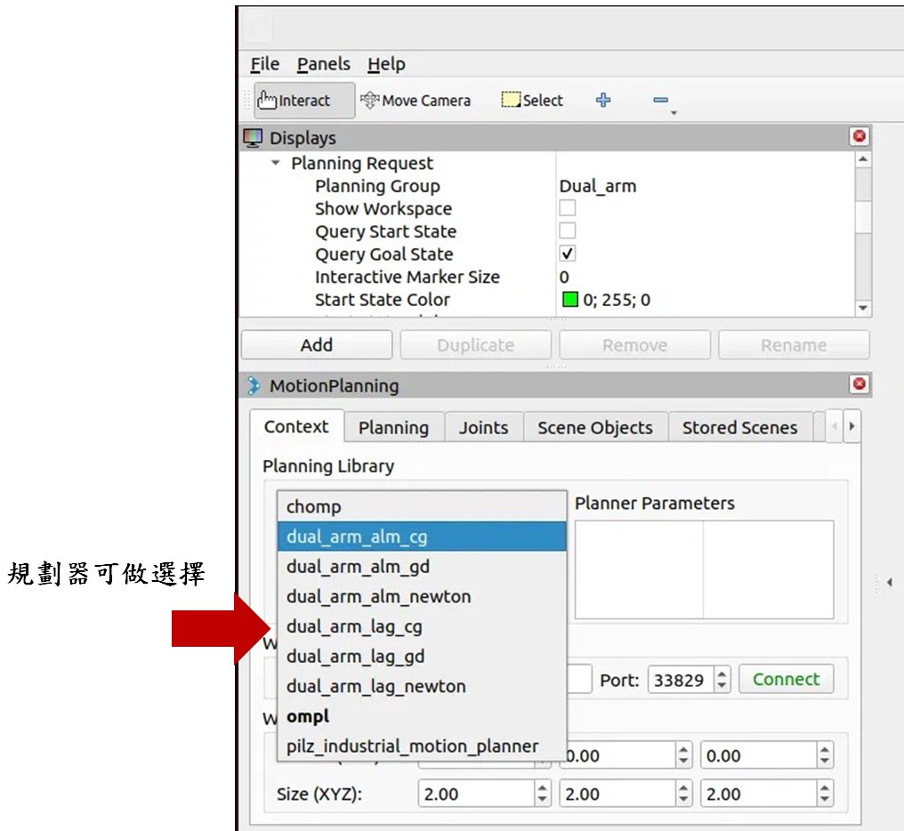
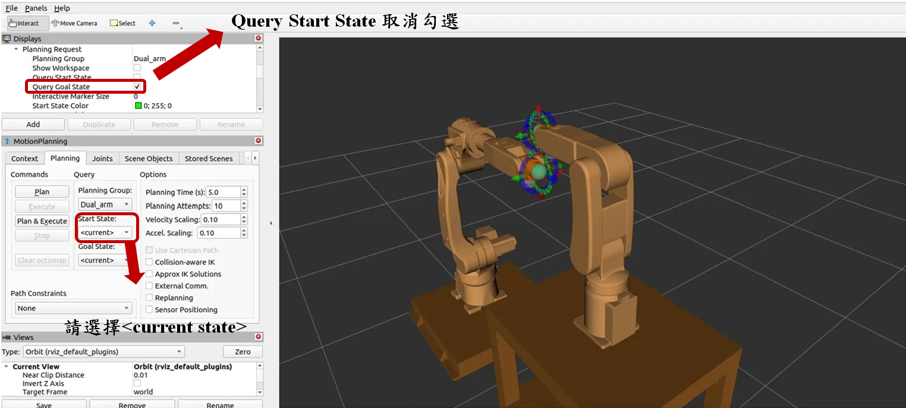
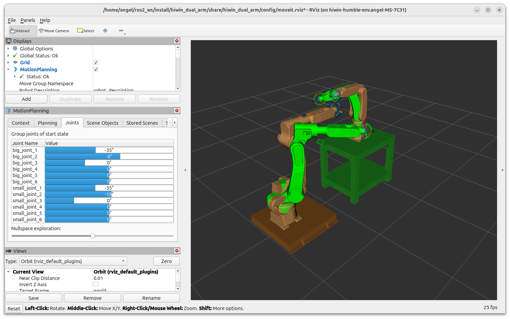

# HIWIN 雙臂機械手 ROS 2 (Humble) 避障路徑規劃工作區 — 使用手冊

> ⚠️ **這個 repo 本身就是一個 ROS 2 workspace 的 `src/` 內容**（repo 根目錄直接是 9 個
> package，不含 `build/`、`install/`、workspace 外層資料夾）。所以 clone 下來後**不能直接
> 在 repo 根目錄 `colcon build`**，必須先建立一個 workspace 資料夾，把這個 repo 放進它的
> `src/` 底下，才能編譯。完整步驟見下方 [3. 環境建置與啟動](#3-環境建置與啟動ros-2-humble)，
> 尤其是 [3.1](#31-第一次建置工作空間依序執行)。

本 repo 共 **9 個 ROS 2 package**：1 個機器人描述包（`hiwin_dual_arm_description`）、
1 個 MoveIt2 設定總包（`hiwin_dual_arm`）、6 個可插拔的雙臂避障「規劃器」方案，以及
1 個跨機/跨 domain 用的橋接包（`dual_arm_domain_bridge`，細節見該 package 自己的
`README.md`）。各規劃器的演算法推導、參數對照表請見個規劃器的
`README.md` / `PARAMETERS.md`；

---

## 1. 這個 workspace 在做什麼

HIWIN 雙臂機械手（A 臂 RA610 + B 臂 RA605，面對面對裝、相距 1400mm）共用工作空間時，
兩臂關節軌跡可能互撞。這個 workspace 給定兩臂各自的起點/終點關節角，自動規劃出一條
**兩臂互不碰撞**的關節空間軌跡，並包成 **MoveIt2 規劃器插件**，在 `move_group` 裡當作
`planning_plugin` 使用。

---

## 2. Package 總覽

```
~/ros2_ws/src/
├── hiwin_dual_arm/                  ← MoveIt2 設定總包（非演算法）
├── hiwin_dual_arm_description/      ← 機器人 URDF/mesh 描述包
├── dual_arm_alm_newton_planner/     ┐
├── dual_arm_alm_cg_planner/         │  ALM 譜系（增廣拉格朗日）
├── dual_arm_alm_gd_planner/         ┘
├── dual_arm_lag_newton_planner/     ┐
├── dual_arm_lag_cg_planner/         │  純 Lagrangian 譜系
├── dual_arm_lag_gd_planner/         ┘
└── dual_arm_domain_bridge/          ← 跨機/跨 domain 橋接包（多機部署才需要）
```

6 個規劃器解的是同一個雙臂避障問題，差別只在內層最佳化用哪種數學模型／求解方法：

| | Newton | CG（共軛梯度） | GD（最陡下降） |
|---|---|---|---|
| **ALM 模型** | `dual_arm_alm_newton_planner` | `dual_arm_alm_cg_planner` | `dual_arm_alm_gd_planner` |
| **純 Lagrangian 模型** | `dual_arm_lag_newton_planner` | `dual_arm_lag_cg_planner` | `dual_arm_lag_gd_planner` |

⚠️ ALM 與純 Lagrangian 是不同數學模型，不可混用參數。

`hiwin_dual_arm/config/dual_arm_*_planning.yaml` 這 6 個檔案各自指定
`planning_plugin` 指向對應的 `DualArmXxxPlannerManager`，並帶入該規劃器的參數；
MoveIt 依檔名（`*_planning.yaml`）自動掃描註冊成 planning pipeline，不用另外維護清單。
`ompl_planning.yaml`  OMPL 有附上官方演算法設定。

---

## 3. 環境建置與啟動（ROS 2 Humble）

> 目標環境：Ubuntu 22.04、ROS 2 Humble。

### 3.0 需要用到的函式庫 / 依賴總覽

以下依賴分兩種：**ROS 2 官方套件**（用 `rosdep`/`apt` 裝，不用手動 clone）與
**C++ 函式庫**（6 個規劃器共用 Eigen3）。實際依賴以各 package 的 `package.xml` /
`CMakeLists.txt` 為準，這裡是彙整版：

| 類別 | 名稱 | 用途 | 誰在用 |
|---|---|---|---|
| ROS 2 核心 | `rclcpp`、`rclcpp_action` | ROS 2 C++ client library | 所有規劃器、`dual_arm_domain_bridge` |
| MoveIt2 | `moveit_core`、`moveit_msgs`、`pluginlib` | 規劃器要繼承的 `PlannerManager` 基底介面 | 6 個 `dual_arm_*_planner` |
| MoveIt2 | `moveit_ros_move_group`、`moveit_planners`、`moveit_kinematics`、`moveit_simple_controller_manager`、`moveit_configs_utils`、`moveit_ros_visualization`、`moveit_ros_warehouse`、`moveit_setup_assistant` | `move_group` 節點本體與 MoveIt 設定總包 | `hiwin_dual_arm` |
| 訊息/介面 | `sensor_msgs`、`control_msgs` | `/joint_states`、軌跡 action 介面 | `dual_arm_domain_bridge` |
| 顯示/描述 | `robot_state_publisher`、`tf2_ros`、`rviz2`、`rviz_common`、`rviz_default_plugins`、`joint_state_publisher`、`joint_state_publisher_gui`、`xacro` | TF、URDF 解析、RViz 視覺化 | `hiwin_dual_arm`、`hiwin_dual_arm_description` |
| 控制 | `controller_manager`、`warehouse_ros_mongo` | `ros2_control` 控制器管理、規劃結果暫存 | `hiwin_dual_arm` |
| C++ 函式庫 | `Eigen3`（`eigen`、`eigen3_cmake_module`） | 矩陣運算，6 個規劃器演算法核心都靠它 | 6 個 `dual_arm_*_planner` |
| 建置工具 | `ament_cmake`、`colcon`、`rosdep` | 編譯與依賴解析 | 全部 package |

> 以上全部**不用手動一個個裝**，下面 3.1 的 `rosdep install` 會依 `package.xml` 自動裝好；
> 若跳過那步，`colcon build` 最常見的報錯就是 `Eigen3` 或 `eigen3_cmake_module` 找不到。

### 3.1 第一次建置工作空間（依序執行）

這個 repo 只是 workspace 的 `src/` 內容，**不是完整 workspace**。第一次拿到手時，要先建立
一個獨立的 workspace 資料夾（這裡以 `~/ros2_ws` 為例，名稱可自訂），把這個 repo 的內容放進
`~/ros2_ws/src/`，再進行編譯：

```bash
# 步驟 1：載入 ROS 2 Humble 環境
source /opt/ros/humble/setup.bash

# 步驟 2：建立 workspace 資料夾（第一次才需要；資料夾已存在則跳過）
mkdir -p ~/ros2_ws

# 步驟 3：把這個 repo 放進 workspace 的 src/
#   方式 A（還沒 clone 過）：直接 clone 成 src/
git clone https://github.com/m11403602-byte/0710_dual_arm_robot_code_fi.git ~/ros2_ws/src

#   方式 B（repo 已經 clone 在別的地方，例如目前就在這個資料夾）：
#   直接把整個資料夾搬過去、改名成 src
# mv /path/to/這個repo ~/ros2_ws/src

# 步驟 4：進入 workspace 根目錄（注意：是 ~/ros2_ws，不是 ~/ros2_ws/src）
cd ~/ros2_ws

# 步驟 5：初始化 rosdep（整台機器只需做一次；之前已 init 過會報錯，忽略即可）
sudo rosdep init
rosdep update

# 步驟 6：依 package.xml 自動安裝所有依賴（見 3.0 表格）
rosdep install --from-paths src --ignore-src -r -y

# 步驟 7：編譯整個 workspace（第一次跑，或改過 src/*.cpp 才需要）
colcon build --symlink-install

# 步驟 8：載入這個 workspace 的環境（每開一個新終端機都要重做）
source install/setup.bash

# 步驟 9：一鍵啟動：TF + robot_state_publisher + move_group + RViz
ros2 launch hiwin_dual_arm brain.launch.py

# 只跑後端、不開 RViz
ros2 launch hiwin_dual_arm brain.launch.py use_rviz:=false
```

> 步驟 3 只需要做一次。之後這個 repo 有更新（`git pull`）時，直接在
> `~/ros2_ws/src` 底下 `git pull`，再回到 `~/ros2_ws` 重跑步驟 7（`colcon build`）即可，
> 不用重新 clone。

只想重編某一個規劃器（例如改了它的 `.cpp`），不用整個 workspace 重 build：

```bash
cd ~/ros2_ws
colcon build --symlink-install --packages-select dual_arm_alm_newton_planner
```

> `--symlink-install` 讓 `config/*.yaml`、`launch/*.py` 用 symlink 安裝，之後**改
> yaml/launch 不用重新 build**，存檔、重啟節點就生效；但改 `src/*.cpp` 仍要重新
> `colcon build`。之後每次開新終端機，只需重做步驟 1、4、8、9（跳過步驟 2、3、5~7 的
> 建置與依賴安裝），除非改了 C++ 原始碼或這個 repo 有更新。

### 3.2 切換規劃器

RViz 左側 **MotionPlanning** 面板 → **Planning** 分頁 → **Planning Library** 下拉選單，
可選擇 `ompl`、`chomp`、`pilz_industrial_motion_planner` 或 6 個 `dual_arm_*` 之一，
選定後按 **Plan** 測試。



### 3.3 設定起點 / 終點關節角（跑規劃前必做）

規劃器要有「起點」「終點」才能算避障軌跡，RViz 開起來預設不會自動幫你設定，需手動指定：

1. **Planning Request** 區塊 → **Query Start State**：
   - `<current state>`：用當下姿態當起點（第一次通常就是全 0，見下方 Home 姿態）。
   - `<random valid>`：隨機產生一組合法起點。
   - 也可以直接在 RViz 3D 場景中拖曳互動式標記（interactive marker）調整。
2. **Query Goal State**：同上，通常選 `<random valid>` 或手動拖曳到想要的終點姿態。
3. 兩邊都設定好後按 **Plan**；成功會在 3D 畫面播放動畫，並在左下角 log 印出耗時。
4. 若要用**精確角度**而非拖曳，可在 **Joints** 分頁裡對 12 個關節
   （`big_joint_1~6`、`small_joint_1~6`）逐一輸入角度。

**內建命名姿態**（`dual_hiwin.srdf` 的 `group_state`，兩邊選單裡都看得到）：

| 名稱 | 對應 group | 內容 |
|---|---|---|
| `Dual_ori` | `Dual_arm`（雙臂） | 12 軸全 0（Home 姿態） |
| `big_ori` | `big`（A 臂） | 6 軸全 0 |
| `small_ori` | `small`（B 臂） | 6 軸全 0 |

可在 Planning 的 Query Start/Goal State 下拉選單直接選這些名稱做快速測試



首先要在Planning 點選 Start/Goal State , 接著在Joint頁面滑桿角度或輸入角度。


## 4. 調整規劃器參數

每個 `dual_arm_*_planner` 的行為（危險因子閾值、碰撞餘隙、最大迭代次數…）由
`hiwin_dual_arm/config/dual_arm_*_planning.yaml` 帶入，欄位定義與建議值請見對應
package 的 `PARAMETERS.md`（例：`src/dual_arm_alm_newton_planner/PARAMETERS.md`）。

```bash
# 1. 編輯對應的 yaml（例如 ALM+Newton 規劃器）
vim src/hiwin_dual_arm/config/dual_arm_alm_newton_planning.yaml

# 2. 因為是 --symlink-install，不用重新 colcon build
#    重啟 move_group（或整個 brain.launch.py）讓新參數生效即可
ros2 launch hiwin_dual_arm brain.launch.py
```


---

## 5. 常見問題排查

- **改了 `config/*.yaml` 但行為沒變**：確認是否用 `--symlink-install` 建置；不是的話要
  重跑 `colcon build --packages-select hiwin_dual_arm` 讓檔案複製進 `install/`。
- **選了 `dual_arm_*` pipeline，但 log 印出 `Multiple planning plugins available...
  Using 'chomp_interface/CHOMPPlanner' for now`**：代表該插件在當下環境找不到，通常是
  終端機沒有 `source install/setup.bash`（或只 source 了單一 package 的
  `local_setup.bash`），或該規劃器 package 沒編譯成功（檢查 build log 有無
  `Failed <<<` / `Aborted <<<`）。
- **`colcon build` 報 `Eigen3` / `eigen3_cmake_module` 找不到**：代表依賴沒裝齊，回到
  [3.1](#31-第一次建置工作空間依序執行) 跑一次 `rosdep install`；或手動
  `sudo apt install libeigen3-dev ros-humble-eigen3-cmake-module`。
- **按 Plan 後 log 出現碰撞相關錯誤或規劃逾時**：先確認 Start/Goal 兩個狀態本身就不互撞
  （在 `<random valid>` 模式下 MoveIt 只保證單臂本身合法，不保證兩臂初始就不互撞）；
  也可以調高 `dual_arm_*_planning.yaml` 裡的 `max_refinement_iter` 或放寬
  `collision_tolerance`（需同時檢查 §4 的邊界限制）。
- **只想看某條軌跡的關節角 / 危險因子數值變化**：規劃器內建 `data_io` CSV 輸出工具
  （見 `src/dual_arm_*_planner/src/data_io.cpp`），可依 `PARAMETERS.md` 說明開啟輸出路徑
  參數，跑完一次 Plan 後到指定路徑查看 CSV。
---

## 6. 上銀（HIWIN）官方 ROS 2 Humble 程式庫

`hiwin_dual_arm` 與官方驅動程式庫不是同一個專案，但可搭配使用：

| 程式庫 | 說明 |
|---|---|
| [hiwin_ros2](https://github.com/HIWINCorporation/hiwin_ros2) | 官方 ROS 2 Humble 主力庫，提供 `ros2_control` 硬體介面與 MoveIt2 整合，支援 RA6/RS4 系列，可切模擬/實機。 |
| [hiwin_robot_client_library](https://github.com/HIWINCorporation/hiwin_robot_client_library) | 封裝與機器人控制器底層通訊的介面庫，供 `hiwin_ros2` 呼叫。 |
| [hiwin_ros](https://github.com/HIWINCorporation/hiwin_ros) | 舊版 ROS 1 程式庫，非 ROS 2。 |

若要接實體雙臂機器人（非僅 RViz/MoveIt 模擬），需另外整合官方 `hiwin_ros2` 提供的
硬體驅動。

---

## 7. 授權

各 package 內文件標示為 MIT（`hiwin_dual_arm_description` 內附 `LICENSE` 檔；其餘 package
於各自 `package.xml` / `README.md` 標註 MIT，未附獨立 LICENSE 檔）。
